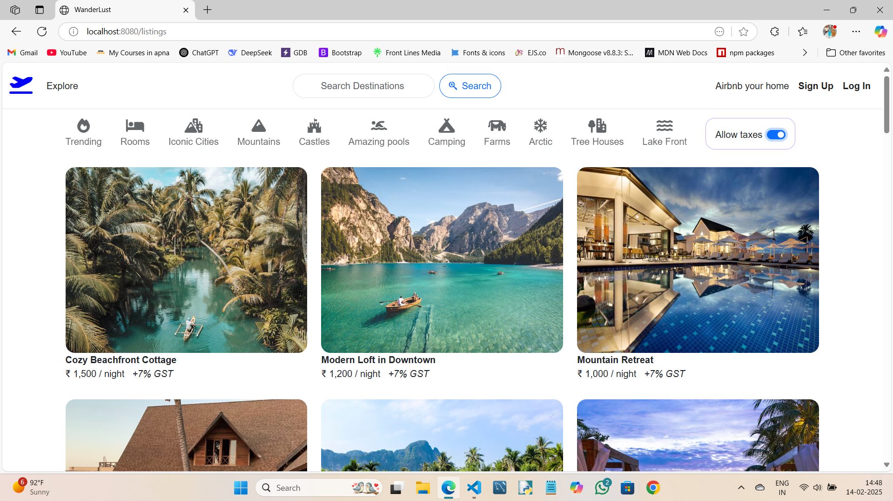
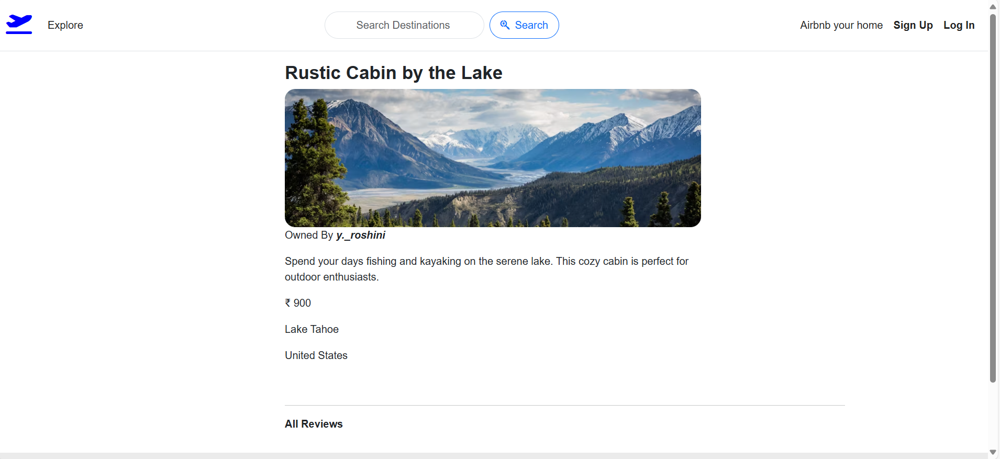
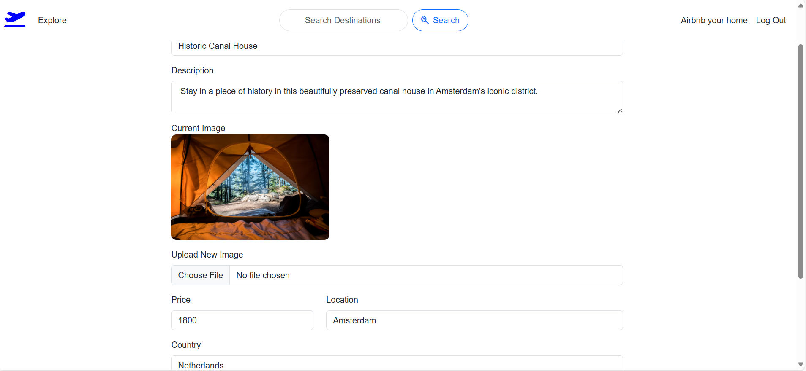
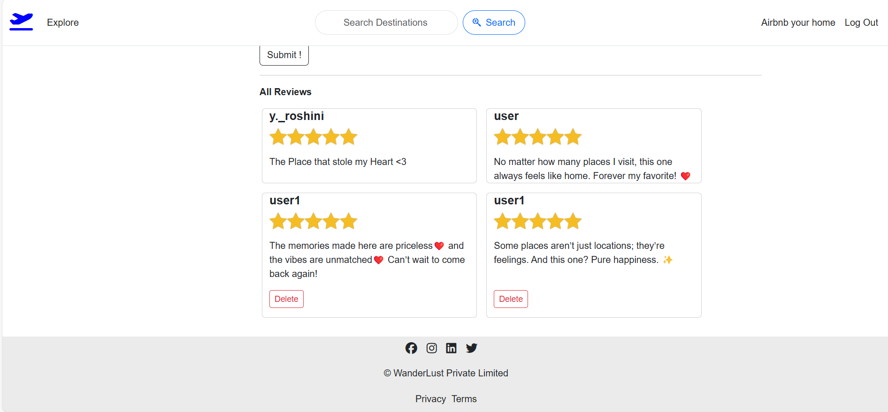
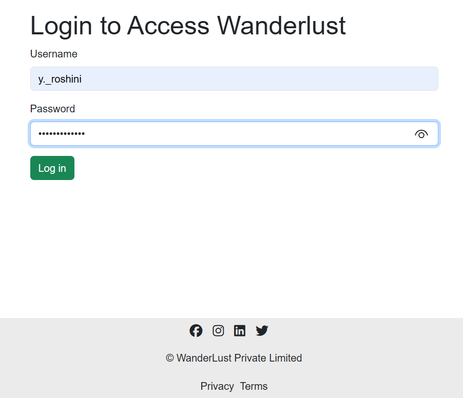

# 🌍 WanderLust - Travel Destination Manager ✈️

**WanderLust** is a web-based platform for discovering and managing travel destinations. Users can explore various listings, add new destinations, leave reviews, and interact with the platform in a seamless manner. Authentication ensures secure access to various functionalities. Whether you're a travel enthusiast or just want to organize your trips, WanderLust is the perfect tool for you.

> 🔗 **Live Demo**: [https://travel-desination-management.onrender.com/listings](https://travel-desination-management.onrender.com/listings)

---

## 🚀 Features

### 🏕️ General Users  
- 🌟 **Sign Up & Log In**  
- 💬 **Leave & Delete Reviews**  
- 📌 **Explore Listings**  

### ✏️ Listing Owners  
- ➕ **Add New Listings**  
- 🔄 **Edit Listings**  
- ❌ **Delete Listings**  
- 🗑 **Manage Reviews**  

---

## 🛠 Tech Stack

- **Frontend**: HTML, CSS, JavaScript, EJS  
- **Backend**: Node.js, Express.js  
- **Database**: MongoDB (Atlas)  
- **Authentication**: Passport.js (Session-based)  
- **Hosting**: Render  

---

## 📸 Screenshots

| Homepage | Destination List |
|---------|------------------|
|  |  |

| Modifying Section | Review Section | Log In Page |
|-------------------|----------------|-------------|
|  |  |  |

---

## ⚙️ Installation & Setup

1. **Clone the repository**
   ```sh
   git clone https://github.com/yourusername/WanderLust.git
   cd WanderLust
2. **Install dependencies**
   ```npm install
3. **Create .env file in the root directory**
   MONGO_URI=your_mongodb_uri
   JWT_SECRET=your_secret_key
   PORT=8080
4. **Seed Initial Data (Optional)**
   node init/index.js

5. **Run the application**
   npm start
6. **Visit the application**

   Local: http://localhost:8080/listings
   Live: https://travel-desination-management.onrender.com/listings


